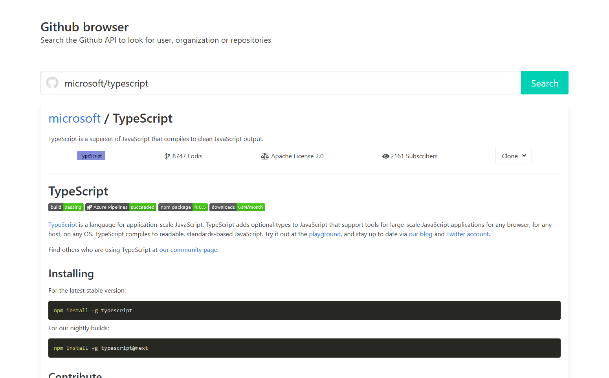
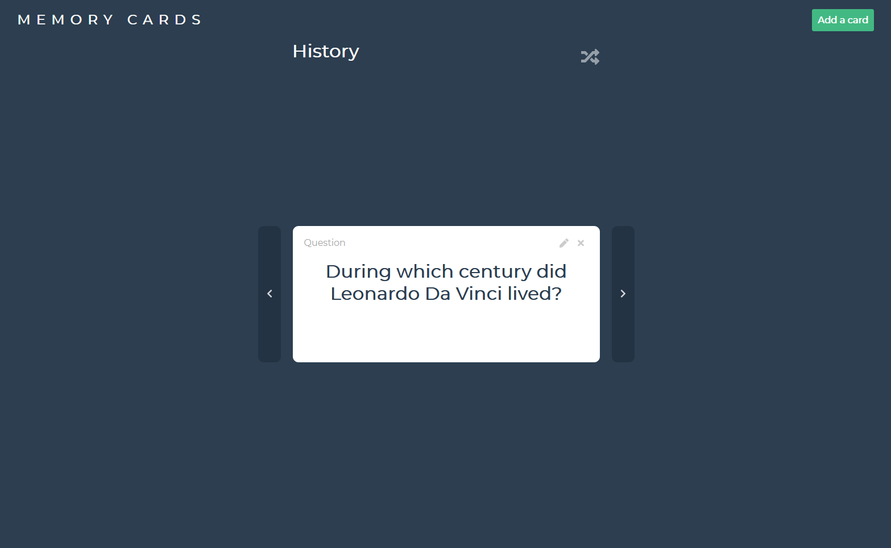
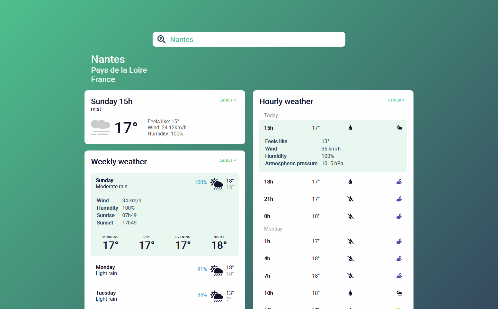
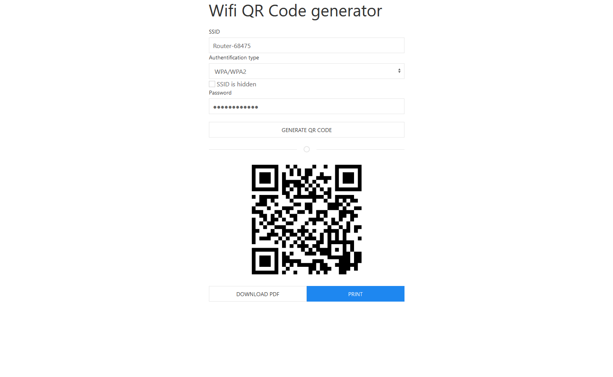
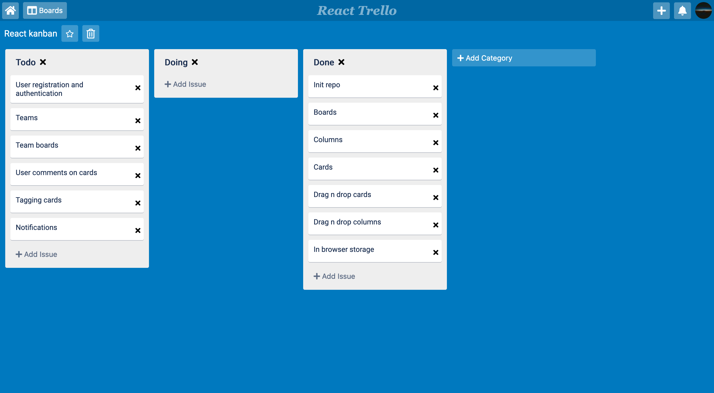

# Hi there :wave:

My name is Antoine and I am a software engineer, mainly focused on web development and frontend technologies.

I don't use Github that much but here you can find some of the projects I do when I try to learn a new stack or test some libraries.

	

## Projects

### Github browser

A simplified github profile and repository browser.

This project was made to get me acquainted with React and Redux.

[Repo](https://github.com/ajulienne/react-github-browser) | [Demo](https://ajulienne.github.io/react-github-browser)

### Memory cards

Create memory cards, each being a question and an answer, to help you memorize stuff. You can categorize them into different subjects, view them in a linear order or shuffle them.

This was made with VueJS, Vuex and VueRouter.

[Repo](https://github.com/ajulienne/memory-cards) | [Demo](https://ajulienne.github.io/memory-cards)

### React Typescript starter

Simple and reusable configuration for any project using React and Typescript.

I wanted to build a simple template that fits most of my needs without having to rely on `create-react-app` for example. It features my most used tools when coding in React, such as `react-testing-library`, `Jest`, `ESlint` and `Prettier`, with `Webpack` and `Babel` to be able to use `Typescript` and `Sass`.

[Repo](https://github.com/ajulienne/react-typescript-starter)

### React weather app

Another react training exercise, building a weather app. My main point of focus here was to use multiple APIs (weather API, location API) to work together to deliver a usable solution and have it work on desktop browser as well as on mobile (PWA).

[Repo](https://github.com/ajulienne/react-weather) | [Demo](https://ajulienne.github.io/react-weather)

### QR wifi generator

Not an exercise, I just made something that could be useful to me and other. This really simple page let you type in your router SSID and password (completely confidential, nothing is stored or sent to any server), and then generate a QR code that you can use to easily connect your phone to the network.

[Repo](https://github.com/ajulienne/qr-wifi) | [Demo](https://ajulienne.github.io/qr-wifi/)

### Kanban (trello clone in React)

I wanted to try and make a more complex application in React, and I think that one of the best way to achieve that is to replicate an existing webapp (you spend more time building and less time designing features, which was not the point of this exercise).

The basic features are here, such as creating boards, creating columns and cards, and of course the drag and drop of cards between columns or even column inside a board to reorganize them. It lacks authentication and therefore all features associated with it (team boards, user comments, assigning cards to a user, etc..).

[Repo](https://github.com/ajulienne/kanban)
